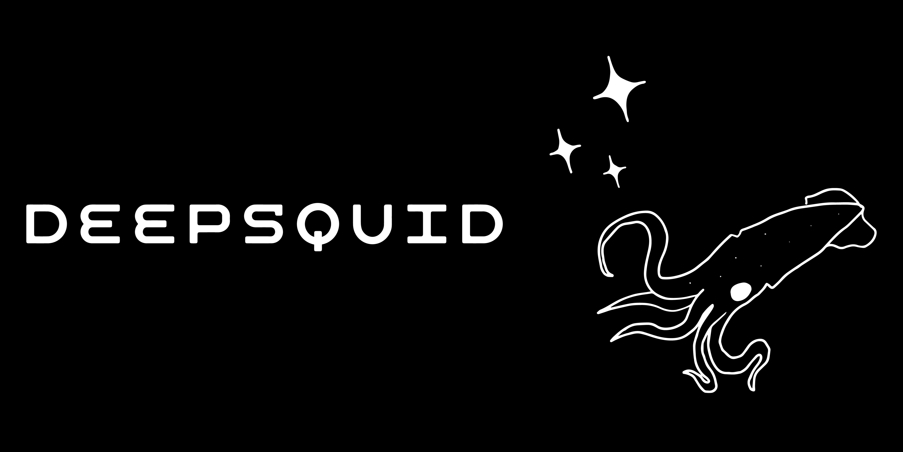

The DeepSquid model uses [Mesonet](https://arxiv.org/abs/1809.00888) to predict deepfake confidence values for each sampled frame of a given YouTube video, and then applies a Recurrent Neural Network (RNN) to the sequence of these frame predictions to produce a final classification for the entire video.

Trained using data from the open-source [Deepstar](https://www.zerofox.com/deepstar-open-source-toolkit/) toolkit, DeepSquid demonstrated promising results, even achieving 100% validation accuracy during training. However, its performance is limited by the relatively small and somewhat outdated dataset. Consequently, newer deepfake models or highly advanced video models like SORA are likely to evade detection by DeepSquid.

Time taken by the demo may vary broadly based on internet connection, but usually takes about 10 seconds to load a video and 20 seconds to classify it. The option to classify a video only becomes available once the video is properly loaded.

You can try the demo here:
[DeepSquid](https://deepsquid.vercel.app/)